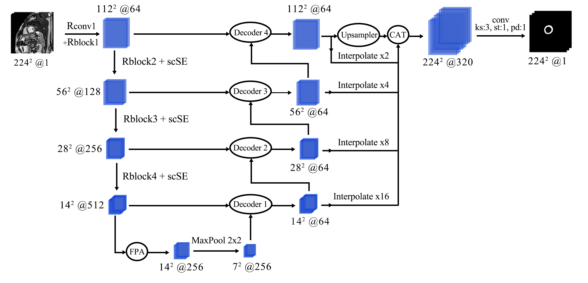
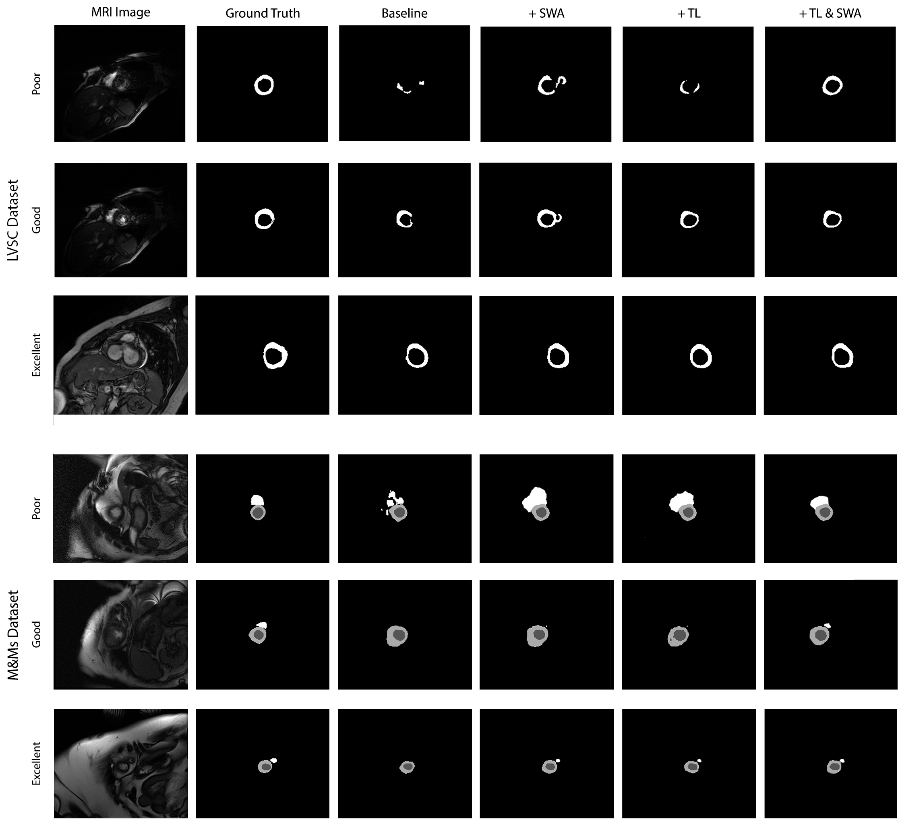

# enhancing_cmr

# Enhancing Cardiac Magnetic Resonance Segmentation using Transfer Learning and Stochastic Weight Averaging Ensembling

This repository is the official implementation of *Enhancing Cardiac Magnetic Resonance Segmentation using Transfer Learning and Stochastic Weight Averaging Ensembling*. 



Network architecture of the segmentator. We use scSE and FPA modules for pixel-precise attention. Pretrained Resnet modules are denoted as Rblocks. Batch dimension is omitted. Decoder blocks use transposed convolutions to enlarge previous decoder steps, concatenate them with corresponding encoder blocks, and then merge all features through a convolution.

The network was implemented using the Pytorch framework and trained in parallel with two NVIDIA RTX 2080 GPU. For data augmentation, we used the albumentations library.

## Requirements

First we will install the packages and virtualenv if we do not have it:

```shell
# Step 1: We update the system repositories
sudo apt-get update
# Step 2: Install pip for Python 3
sudo apt-get install build-essential libssl-dev libffi-dev python-dev
sudo apt install python3-pip
# Step 3: Use pip to install virtualenv
sudo pip3 install virtualenv 
```

Next, we create our virtual environment and activate it:

```shell
# Create the virtual environment 'cmr_env'
python3 -m venv cmr_env
# Activate the virtual environment
source cmr_env/bin/activate
```

Finally, to install requirements:

```setup
pip install -r requirements.txt
```

## Training

To train the model(s) in the paper, run this command:

```train
python train.py --input-data <path_to_data> --alpha 10 --beta 20
```

>📋  Describe how to train the models, with example commands on how to train the models in your paper, including the full training procedure and appropriate hyperparameters.

## Evaluation

To evaluate my model on ImageNet, run:

```eval
python eval.py --model-file mymodel.pth --benchmark imagenet
```

>📋  Describe how to evaluate the trained models on benchmarks reported in the paper, give commands that produce the results (section below).

## Pre-trained Models

You can download pretrained models here:

- [My awesome model](https://drive.google.com/mymodel.pth) trained on ImageNet using parameters x,y,z. 

>📋  Give a link to where/how the pretrained models can be downloaded and how they were trained (if applicable).  Alternatively you can have an additional column in your results table with a link to the models.

## Results

Our model achieves the following performance on :

### [Left Ventricular Segmentation Challenge](http://www.cardiacatlas.org/challenges/lv-segmentation-challenge/)

| Method                    | Jaccard | Dice  |
|---------------------------|---------|-------|
| Our approach              |  0.744  | 0.845 |
| + Transfer Learning       |  0.756  | 0.854 |
| + SWA                     |  0.765  | 0.860 |
| + Transfer Learning & SWA |  0.771  | 0.865 |

### [Open M&Ms Challenge](https://www.ub.edu/mnms/)

| Method                    | Jaccard | Dice  | Hausdorff  | ASSD  |
|---------------------------|---------|-------|------------|-------|
| Our approach              |  0.722  | 0.827 |   21.359   | 1.592 |
| + Transfer Learning       |  0.738  | 0.840 |   19.540   | 1.589 |
| + SWA                     |  0.771  | 0.865 |   15.821   | 1.302 |
| + Transfer Learning & SWA |  0.779  | 0.870 |   12.897   | 1.137 |

### Qualitative Results

Qualitative results comparing the baseline approach, adding Transfer Learning (TL) and SWA techniques. Samples are grouped as poor (< 0.5 Jaccard), good (between 0.5 and 0.8 Jaccard), and excellent (> 0.8 Jaccard) when using the baseline approach.



## Acknowledgements

The authors thank EU-FEDER Comunitat Valenciana 2014-2020 grant IDIFEDER/2018/025.
